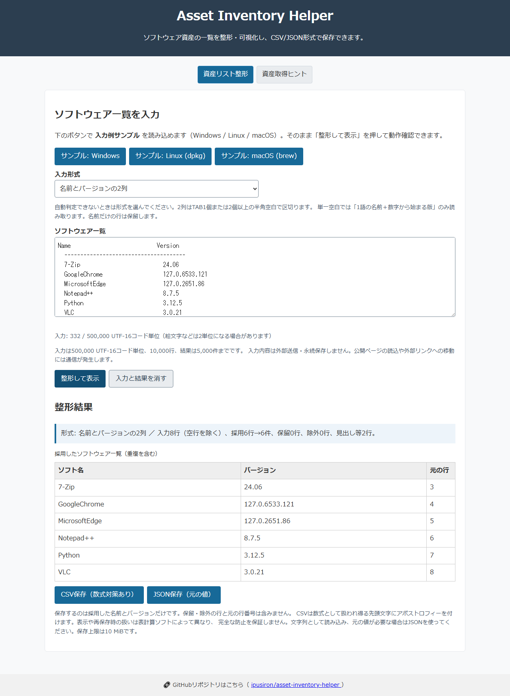

English · [日本語](README.md)

# Asset Inventory Helper - Software Asset Inventory Support


[](https://ipusiron.github.io/asset-inventory-helper/)

**Day059 - 100 Security Tools with Generative AI**

Asset Inventory Helper is a web tool for formatting software lists you have already collected.
Review names and versions, hold ambiguous lines for review, and save accepted records as CSV or JSON.
It does not automatically inspect devices or networks.

The interface and screenshots are currently in Japanese. This README provides the English explanation.

---

## 🌐 Demo

👉 **[https://ipusiron.github.io/asset-inventory-helper/](https://ipusiron.github.io/asset-inventory-helper/)**

Try it directly in your browser.

---

## 📸 Screenshots

> 
>
> *Software names and versions (Japanese interface)*

---

## 🎯 Background and purpose

Checking the software on PCs and servers involves organizing collected lists into a readable form.
This tool assists with that formatting; it does not guarantee that collection is complete or that supplied names and versions are correct.

## ✨ Main features

- Automatic format detection and manual selection
- Parsing of two-column name/version text, winget, dpkg, and Homebrew
- Reasons, original text, and source line numbers for held and excluded lines
- Record counts and an overall stop when a limit is exceeded
- CSV with formula mitigation and JSON that preserves the parsed values
- Invalidation of old results and export controls when the input or format changes

### 📝 Development status

Supported formats are limited to the table below.
Search, difference comparison, automatic deduplication, and unauthorized-software detection are not implemented.

- [Technical specification (Japanese)](TECHNICAL.md): parsing and export rules
- [Command reference (Japanese)](COMMANDS.md): collection methods and supported scope
- [Security measures and limitations (Japanese)](SECURITY.md): CSP, CSV, and saved-data cautions
- [Development log (Japanese)](DEVLOG.md): development records

## 💡 Use cases

- Small-organization inventories: format lists collected from individual devices and add device names, administrators, and other fields in a separate register. Names and versions alone do not make a complete asset register.
- Education and training: compare valid and ambiguous sample lines to learn about misclassification when converting text to tables.
- PC migration planning: record installed home-PC applications and plan reinstalls. License and settings migration are not included.
- Recording a production environment: save software versions used for video editing or development and attach them to work notes. This does not guarantee reproducibility of the entire environment.
- Organizing research material: save a research device's list as JSON for a separate aggregation script. Comparisons are performed externally.

## 🔐 Relationship to security

A software list can support decisions about updates and authorization.
This tool does not compare records with vulnerability databases or approved-software lists, so it does not automatically identify unsafe versions or unauthorized software.
Record devices, owners, collection times, licenses, and similar information separately.

## 🚀 Quick start

### Basic procedure

1. Collect a software list.
   Run the appropriate OS command to obtain a list of installed software; see the next section.
2. Paste the text into the tool.
   Open the [demo](https://ipusiron.github.io/asset-inventory-helper/) and paste the collected text into the input field.
3. Format and review.
   Select the input format, press “整形して表示” (Format and display), and review accepted records and the reasons for holding or excluding lines.
4. Export.
   Save accepted records as CSV or JSON. Held/excluded lines and source line numbers are not exported.

### Trying the sample data

Use the “サンプル: Windows/Linux/macOS” buttons to load illustrative samples and check the behavior. The Windows sample is two-column name/version text.
The accepted counts are 6 for Windows, 5 for Linux, and 5 for macOS. Sample versions do not represent the latest releases.

---

## 🖥️ Collecting software lists

### Basic commands

| Selected format | Example command | Parsing conditions |
|---|---|---|
| Automatic / winget | `winget list` | A table with English or Japanese Name, ID, and Version headers. Columns must be separated by a TAB or at least 2 ASCII spaces |
| Automatic / dpkg | `dpkg -l` | Accepts rows whose current state is installed and which have no error. States such as rc are excluded |
| Homebrew | `brew list --versions` | A 1-word name and versions. Multiple versions become separate records |
| 2-column name/version | `rpm -qa --qf '%{NAME}\t%{VERSION}-%{RELEASE}\n'` | Uses 1 TAB to separate 2 columns |

For Homebrew, select the format manually or include the executed command line at the start of the input.
Two-column input also supports separators of at least two ASCII spaces.
With a single space, only a one-word name followed by a version beginning with a digit is accepted.
Use a TAB separator if the name contains spaces.
If the version is unknown, place one TAB after the name and leave the second column empty.
Whitespace around separators is trimmed.

Default `rpm -qa` output, `system_profiler`, Snap, and CSV/JSON input are unsupported.
Truncated or ambiguous lines are held for review.
Recognized winget IDs contain a dot or backslash, or consist of at least 12 uppercase ASCII letters and digits. Other forms are held.
See the [command reference (Japanese)](COMMANDS.md) for details.

### Parsing examples

In this table, `\t` represents one TAB.

| Input | Format | Accepted name | Accepted version | Status |
|---|---|---|---|---|
| `Node.js 22.6.0` | auto | Node.js | 22.6.0 | Accepted |
| `namebench 1.3.1` | auto | namebench | 1.3.1 | Accepted |
| `VLC media player\t3.0.21` | columns | VLC media player | 3.0.21 | Accepted |
| `VLC media player` | auto | — | — | Held |
| `bash-5.2.26-1.fc40.x86_64` | auto | — | — | Held |

## 🗂️ Asset management beyond software

This tool focuses on software assets, but comprehensive security also requires managing the following:

- Hardware assets: PCs, servers, and network devices
- Cloud assets: IaaS, PaaS, and SaaS
- Portable software: applications that do not use an installer

See the [command reference (COMMANDS.md, Japanese)](COMMANDS.md) for more information about managing these assets.

---

## 🔒 Data privacy and security

### Data handling

- Parsing and export run in the browser; the app does not transmit the input externally.
- Input and results are not stored in localStorage, cookies, or the URL. They remain on screen and in memory, so use “入力と結果を消す” (Clear input and results) after use.
- Loading the public page and following external links involves network traffic. The app does not load analytics or advertising scripts.
- Downloaded files remain on the device. Clearing the interface does not delete them.

### CSV formula mitigation

CSV uses UTF-8 with a BOM, CRLF line endings, and the column names `name,version`.
Every cell is quoted, with embedded quotes doubled.
An apostrophe is prepended to values beginning with characters that may be interpreted as formulas, including `= + - @` and their full-width equivalents.
This protection changes the value and may not survive every spreadsheet application or resaving method.
Import values as text, and use JSON to preserve the original parsed values.
JSON retains only the accepted `name` and `version` fields.

There is no universally effective CSV protection method. See [OWASP CSV Injection](https://community.owasp.org/attacks/CSV_Injection).
Check that files do not contain confidential information before sharing them.

## 🛠️ Troubleshooting

### Common problems and solutions

- Cannot format the input: select the format and read the hold reasons. Separate mixed formats, and convert ambiguous lines into TAB-separated name/version columns.
- No export button: export is unavailable after input changes, after a limit is exceeded, or when no records are accepted. Review the input and format it again.
- Garbled text: check the input encoding. Import exported CSV as UTF-8.
- Missing version: in two-column format, put one TAB after the name and leave the version empty. A name-only line is held for review.

## 🧭 Relationship to security frameworks

### 🛡️ CIS Controls

[CIS Control 2](https://www.cisecurity.org/controls/inventory-and-control-of-software-assets) addresses software asset management.
This tool can help organize lists, but does not determine authorization, control execution, or collect a comprehensive organization-wide inventory.
It also does not implement the hardware asset management addressed by Control 1.

### 📘 ISO/IEC 27001

Saved lists can serve as asset-management material.
The tool does not assign ownership or management responsibility, or assess whether controls have been implemented.

### 🏛️ NIST Cybersecurity Framework

[NIST CSF 2.0 ID.AM-02](https://www.nist.gov/document/csf-20-implementations-pdf) addresses maintaining inventories of software, services, and systems.
This tool is limited to organizing the software names and versions pasted into it.

### Scope

Producing an export does not demonstrate compliance with any of these frameworks.
Users must verify the collection scope and management procedures separately.

## ⚠️ Cautions and limitations

### Usage cautions

- The tool helps organize software lists; it does not automatically inspect devices or verify completeness.
- Held and excluded lines are not saved, so review their counts and reasons.
- Names, versions, and states are values supplied by the collection source; the tool does not prove their authenticity.

### Technical limits

| Item | Limit |
|---|---|
| Input | 500,000 UTF-16 code units |
| Physical lines, including blank lines | 10,000 lines |
| Accepted records | 5,000 records |
| Export file | 10 MiB (10,485,760 bytes) |

Exceeding a limit is an overall error; the tool does not save a partial result.
The limits do not prevent a large paste in advance or guarantee that device load is completely avoided.
A single character, such as an emoji, may occupy two code units.
Rows with the same name and version remain duplicated, and records are not sorted.

## 🧪 Tests

Run `npm test` with Node.js 22 or later.
No dependency installation is required.
Tests cover parsing examples, boundaries, CSV, JSON, HTML, and the README tables.
GitHub Actions runs the same tests on push and pull_request.

## 📁 Directory structure

```text
asset-inventory-helper/
├── index.html            # Main HTML
├── script.js             # Input, display, and download interactions
├── inventory-core.js     # Parsing and CSV/JSON generation
├── inventory-messages.js # Dynamic messages
├── package.json          # Dependency-free test configuration
├── test/                 # Node.js built-in tests
│   ├── core.test.js       # Parsing and export tests
│   ├── readme-en.test.js  # Japanese/English README consistency
│   └── readme.test.js     # Documentation and HTML checks
├── .github/              # GitHub configuration
│   └── workflows/        # Automated tests
│       └── test.yml       # Node.js 22 tests
├── style.css             # Styles
├── assets/               # Images and static files
│   └── screenshot.png    # Screenshot
├── README.md             # Japanese README
├── README.en.md          # English README
├── CLAUDE.md             # Claude Code guide
├── AGENTS.md             # Development guidelines
├── COMMANDS.md           # Command examples
├── DEVLOG.md             # Development log
├── SECURITY.md           # Security guide
├── TECHNICAL.md          # Technical specification
├── LICENSE               # License
├── .gitignore            # Git exclusions
└── .nojekyll             # GitHub Pages configuration
```

---

## 💻 Requirements

Use a modern browser with JavaScript enabled.
Locally, open `index.html` directly, or run `python -m http.server 8000` in the project root and visit `http://localhost:8000/`.
There is no build step.

## 📄 License

MIT License. See [LICENSE](LICENSE) for details.

---

## 🛠️ About this tool

This tool is part of the “100 Security Tools with Generative AI” project.
The project creates and publishes security-related tools over 100 days with AI assistance.

For project details and other tools, see:

🔗 [Project overview (Japanese)](https://akademeia.info/?page_id=42163)
