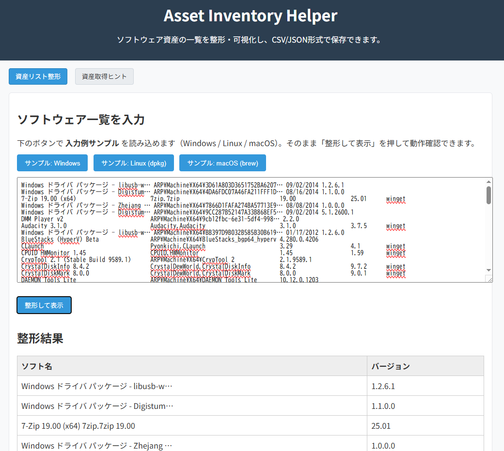

<!--
---
title: Asset Inventory Helper
category: security-management
difficulty: 1
description: A web-based tool to organize and visualize software assets, with CSV/JSON export support. Designed to align with CIS Controls v8 (Control 1 and 2), helping users experience the first step of asset management in security frameworks.
tags: [asset, inventory, software, cis, security]
demo: https://ipusiron.github.io/asset-inventory-helper/
---
-->


[](https://ipusiron.github.io/asset-inventory-helper/)

**Day059 - 生成AIで作るセキュリティツール100**

# Asset Inventory Helper

**Asset Inventory Helper**は、IT資産管理の第一歩となる「ソフトウェア資産の洗い出し」を支援するWebベースの教育用ツールです。

組織の「見えていないIT資産」を整理し、棚卸しを支援します。
ソフトウェアの一覧を整形・可視化し、資産管理やセキュリティ対策の出発点を作ります。 

CIS Controls v8における **Control 1（エンタープライズ資産の管理）** および **Control 2（ソフトウェア資産の管理）** に対応する取り組みを、シンプルに体験できるよう設計されています。  

---

## 🌐 デモページ

👉 **[https://ipusiron.github.io/asset-inventory-helper/](https://ipusiron.github.io/asset-inventory-helper/)**

ブラウザーで直接お試しいただけます。

---

## 📸 スクリーンショット

>
>
>*ソフトウェア名とバージョンの一覧表示*

---

## 🎯 背景と目的

組織におけるセキュリティ対策の出発点は、**自分たちがどのような資産を持っているかを把握すること**です。  
セキュリティインシデントの多くは「未管理の機器」や「シャドーIT」、あるいは「意図せず残された古いソフトウェア」から発生します。  

Asset Inventory Helper は、以下のような状況で役立ちます。

- Windows の「アプリと機能」一覧や Linux の `dpkg -l` / `rpm -qa` などを取得したが、そのままでは見づらい  
- 各PCやサーバーにインストールされているソフトを、管理簿に整理して残したい  
- セキュリティフレームワーク（CIS Controls, NIST CSF など）で要求される「資産管理」を手軽に実践したい  

---

## ✨ 主な機能

- **OSごとの取得方法を提示**  
  - Windows: 「アプリと機能」や `wmic product get name`  
  - Linux: `dpkg -l`, `rpm -qa` など  
  - macOS: `brew list`  
- **取得結果を貼り付けて整理**  
  - ペーストしたテキストを表形式に変換  
  - 不要な空行や重複を自動整形  
- **エクスポート機能**  
  - CSV や JSON として保存可能  
  - 管理台帳に流用しやすい  
- **将来拡張（計画中）**  
  - 未承認ソフトの検出（ホワイトリスト比較）  
  - シャドーITの洗い出し  
  - ネットワーク機器リスト（nmap などの結果取り込み）

### 📝 開発状況について

本ツールは現在も発展途上にあり、以下の点にご留意ください：

- **シンプルな実装**: 教育目的のため、あえてシンプルな機能に留めています
- **発展途上の機能**: パース精度や対応形式は今後改善予定です
- **詳細はREADMEで**: ツール内で説明しきれない詳細な使用方法や技術情報は、このREADME.mdに集約しています

**→ 実際の資産管理に必要な詳細情報は、このREADME.mdをご参照ください。**

📖 **[開発日誌（DEVLOG.md）](DEVLOG.md)** - ツールの作り込みが甘い点や今後の改善案について、正直に記載しています。

🔒 **[セキュリティ改善履歴（SECURITY.md）](SECURITY.md)** - GitHub Pages公開前に実施したセキュリティ強化の詳細を記載しています。

⚙️ **[技術仕様書（TECHNICAL.md）](TECHNICAL.md)** - コアアルゴリズム、プログラミングテクニック、技術的な設計判断について詳しく解説しています。

📌 **[コマンドリファレンス（COMMANDS.md）](COMMANDS.md)** - 各OSでの詳細なコマンドと、ハードウェア・クラウド資産の管理方法を記載しています。

---

## 💡 活用例

1. **小規模組織の資産棚卸し**  
   IT担当がいない小さな会社でも、PCのアプリ一覧をコピーしてツールに貼り付ければ、資産台帳をすぐに整備できます。  

2. **教育・トレーニング**  
   セキュリティ研修において「まずは資産を見える化する」ことを体験させる題材として活用できます。  

3. **セキュリティフレームワーク実践の第一歩**  
   - CIS Controls v8: Control 1, Control 2  
   - NIST Cybersecurity Framework: ID.AM (資産管理)  
   - ISO/IEC 27001: A.5.9 (情報およびその他の関連資産の目録)  

---

## 🔐 セキュリティとの関連性

### なぜ資産管理がセキュリティの出発点なのか

- **資産の可視化がなければ、制御も防御もできない**  
  攻撃者は「見えない資産」を狙います。管理者が把握していない機器やソフトは、最も弱いリンクとなりやすいです。  

- **セキュリティフレームワークにおける優先度の高さ**  
  CIS Controls、NIST CSF、ISO 27001など、主要なフレームワークすべてが「資産管理」を最初のステップに位置付けています。  

- **棚卸し → 制御へ**  
  このツールで作成したリストは、その後の「利用許可」「バージョン管理」「脆弱性スキャン」などのプロセスにつながります。

### 実際のインシデント事例から学ぶ

- **古いバージョンの放置**: パッチ未適用の古いソフトウェアが侵入経路となるケース
- **シャドーIT**: IT部門が把握していないソフトウェアからの情報漏洩
- **ライセンス違反**: 管理外ソフトウェアの不正利用による法的リスク  

---

## 🚀 使い方（クイックスタート）

### 基本的な使用手順

1. **ソフトウェア一覧の取得**  
   各OSのコマンドを実行して、インストール済みソフトの一覧を取得します（詳細は次セクション参照）

2. **ツールへの貼り付け**  
   [デモページ](https://ipusiron.github.io/asset-inventory-helper/)を開き、取得したテキストを入力欄に貼り付けます

3. **整形と確認**  
   「整形して表示」ボタンをクリックし、表形式で結果を確認します

4. **エクスポート**  
   CSV または JSON 形式でダウンロードし、資産管理台帳として保管・共有します

### サンプルデータで試す

ツール画面の「サンプル: Windows/Linux/macOS」ボタンで、各OSの出力例を読み込んで動作を確認できます。

---

## 🖥️ ソフトウェア一覧の取得方法

### 基本コマンド

- **Windows**: `winget list`
- **Linux (Debian/Ubuntu)**: `dpkg -l`
- **Linux (RedHat/CentOS)**: `rpm -qa`
- **macOS**: `brew list --versions`

詳細なコマンドや高度な取得方法については **[コマンドリファレンス（COMMANDS.md）](COMMANDS.md)** をご参照ください。

---

## 🗂️ より広い視点での資産管理

本ツールはソフトウェア資産に焦点を当てていますが、完全なセキュリティ対策には以下の資産も管理が必要です：

- **ハードウェア資産**: PC、サーバー、ネットワーク機器
- **クラウド資産**: IaaS、PaaS、SaaS
- **ポータブルソフトウェア**: インストーラーを使わないアプリケーション

これらの詳細な管理方法については **[コマンドリファレンス（COMMANDS.md）](COMMANDS.md)** をご参照ください。

---

## 🔒 データプライバシーとセキュリティ

### データ処理について

- **完全にローカル処理**: すべての処理はブラウザー内で実行され、外部サーバーへのデータ送信は一切行いません
- **データの保存なし**: 入力されたデータは処理後も保存されず、ページをリロードすると消去されます
- **トラッキングなし**: Google Analytics などの分析ツールは使用していません

### セキュリティ上の注意

- 機密性の高い環境では、エクスポートしたファイルの取り扱いに注意してください
- 資産リストには潜在的にセキュリティ情報が含まれるため、適切なアクセス制御を行ってください

---

## 🛠️ トラブルシューティング

### よくある問題と解決方法

**Q: 貼り付けたデータが正しく整形されない**
- A: 入力データの形式を確認してください。ヘッダー行や区切り線は自動的に除外されますが、特殊な形式の場合は手動で不要な行を削除してください。

**Q: エクスポートボタンが表示されない**
- A: データの整形が完了していない可能性があります。「整形して表示」ボタンをクリックしてください。

**Q: 文字化けが発生する**
- A: UTF-8エンコーディングに対応しています。コマンド出力時の文字コードを確認してください。

**Q: バージョン情報が取得できない**
- A: 一部のソフトウェアはバージョン情報を提供しない場合があります。その場合は空欄として処理されます。

---

## 🧭 セキュリティフレームワークとの関連性

本ツールは、国際的なセキュリティフレームワークにおける「資産管理」の実践をサポートします。  
資産を正しく把握・整備することは、どのフレームワークにおいても最初のステップに位置付けられています。

### 🛡️ CIS Controls v8
- **Control 1: Inventory and Control of Enterprise Assets**  
  すべてのハードウェア資産（PC、サーバー、ネットワーク機器、モバイルなど）を特定・管理し、許可されていない機器が接続されないようにする。  
- **Control 2: Inventory and Control of Software Assets**  
  稼働するソフトウェアをすべて特定・管理し、非承認ソフトが導入・実行されないよう制御する。  
- **本ツールの役割**: 特に Control 2 に直結し、ソフトウェア一覧を整理・可視化することで、未承認ソフトや古いバージョンの特定を支援。

### 📘 ISO/IEC 27001:2022
- **A.5.9 情報およびその他の関連資産の目録**  
  組織の資産を明確に特定・文書化し、責任者を割り当てることを要求。  
- **A.8.1 資産に関する責任**  
  資産ごとに所有者を定義し、管理責任を明確化することを求める。  
- **本ツールの役割**: 資産リストを整理・出力することで、資産目録作成とオーナーシップ付与の基礎資料を提供。

### 🏛️ NIST Cybersecurity Framework (CSF) v1.1
- **ID.AM-1**: 物理デバイスとシステムの資産が特定され、管理されている。  
- **ID.AM-2**: ソフトウェア資産が特定され、管理されている。  
- **ID.AM-3**: 組織の通信およびデータフローが特定されている。  
- **本ツールの役割**: 特に ID.AM-2 を支援し、ソフトウェア資産の可視化を通じて ID.AM-1/3 にも発展的に貢献。

### 総合的な位置づけ
- **共通点**: いずれのフレームワークでも「資産の可視化」が最初のステップ。  
- **本ツールの意義**: 教育や小規模実践環境において、ソフトウェア資産の棚卸しを簡易に体験できる仕組みを提供。  
- **拡張性**: 今後ハードウェア・ネットワーク・クラウド資産管理に範囲を広げることで、複数フレームワークにまたがる実務対応が可能になる。  

---

## ⚠️ 注意事項と制限

### 利用上の注意

- 本ツールは教育・研究・自己学習を目的としています  
- 実際の企業環境で利用する場合は、組織のセキュリティポリシーやコンプライアンス要件にしたがってください  
- 自動スキャンや強制的な収集機能は含まれていません

### 技術的な制限

- **対応形式**: 主要なパッケージ管理ツールの出力形式に対応していますが、カスタム形式には対応していない場合があります
- **処理能力**: ブラウザーのメモリ制限により、大量のデータ（数千件以上）の処理には時間がかかる場合があります
- **バージョン認識**: バージョン番号の形式が特殊な場合、正しく認識されない可能性があります
- **重複検出**: 同じソフトウェアの異なるバージョンが複数インストールされている場合、すべて表示されます  

---

## 📁 ディレクトリー構成

```
asset-inventory-helper/
├── index.html          # メインHTMLファイル
├── script.js           # アプリケーションロジック
├── style.css           # スタイルシート
├── assets/             # 画像・静的ファイル
│   └── screenshot.png  # スクリーンショット
├── README.md           # プロジェクト説明書
├── CLAUDE.md           # Claude Code向けガイド
├── AGENTS.md           # 開発ガイドライン
├── COMMANDS.md         # コマンド実行例
├── DEVLOG.md           # 開発ログ
├── SECURITY.md         # セキュリティガイド
├── TECHNICAL.md        # 技術仕様書
├── LICENSE             # ライセンスファイル
├── .gitignore          # Git除外設定
└── .nojekyll           # GitHub Pages設定
```

---

## 📄 ライセンス

MIT License – 詳細は [LICENSE](LICENSE) を参照してください。

---

## 🛠 このツールについて

本ツールは、「生成AIで作るセキュリティツール100」プロジェクトの一環として開発されました。 
このプロジェクトでは、AIの支援を活用しながら、セキュリティに関連するさまざまなツールを100日間にわたり制作・公開していく取り組みを行っています。

プロジェクトの詳細や他のツールについては、以下のページをご覧ください。  

🔗 [https://akademeia.info/?page_id=42163](https://akademeia.info/?page_id=42163)
